# Resume Parser Service - GitHub Backlog

> Generated from software assessment on 2025-12-04
> Overall Score: **2/5** - Significant remediation required

---

## Epics Overview

| Epic | Priority | Issues | Theme |
|------|----------|--------|-------|
| [E1] Security & Secrets Management | P1 | 6 | Critical security vulnerabilities |
| [E2] Code Quality & Standards | P2 | 8 | Maintainability improvements |
| [E3] Testing & Quality Assurance | P1 | 5 | Test coverage gaps |
| [E4] Architecture & Design | P2 | 6 | Structural improvements |
| [E5] DevOps & Infrastructure | P2 | 5 | CI/CD and deployment |
| [E6] Documentation | P3 | 4 | Developer experience |
| [E7] Performance & Optimization | P3 | 4 | Runtime efficiency |

---

## Epic 1: Security & Secrets Management

> **Priority:** P1 - Critical, Blocking
> **Goal:** Eliminate hardcoded secrets, fix authentication vulnerabilities, implement secure configuration

### Issues

#### [SEC-001] Remove hardcoded DeepInfra API key from text_embedder.py
**Priority:** P1 | **Type:** security | **Area:** core

**What:**
Hardcoded API key exposed in `app/libs/text_embedder.py:14`:
```python
api_key: str = "lNU91OY7jk60zBlIFqJejlMkJDw6tLpM"
```

**Why:**
- API key exposed in git history
- Violates OWASP A02 (Cryptographic Failures)
- Risk of unauthorized API usage and billing

**Acceptance Criteria:**
- [ ] Remove hardcoded API key from source code
- [ ] Add `DEEPINFRA_API_KEY` to Settings class in `config.py`
- [ ] Update `.env.example` with placeholder
- [ ] Rotate the exposed key in DeepInfra dashboard
- [ ] Verify text embedder works with env-based key

**Estimate:** 1h

---

#### [SEC-002] Fix weak default secrets in configuration
**Priority:** P1 | **Type:** security | **Area:** config

**What:**
Weak default values in `app/core/config.py:27-33`:
```python
secret_key: str = os.getenv("SECRET_KEY", "your-secret-key-here")
openai_api_key: str = os.getenv("OPENAI_API_KEY", "your-openai-api-key-here")
```

**Why:**
- Default values could be used in production if env vars not set
- JWT tokens would be easily forgeable
- Security misconfiguration vulnerability

**Acceptance Criteria:**
- [ ] Remove default values for sensitive settings
- [ ] Raise `ValueError` on startup if required secrets not configured
- [ ] Add validation in `Settings.__init__` or use Pydantic validators
- [ ] Document required environment variables

**Estimate:** 2h

---

#### [SEC-003] Implement proper exception handling in authentication
**Priority:** P1 | **Type:** security | **Area:** auth

**What:**
Generic exception handling in `app/core/auth.py:26`:
```python
except Exception:
    raise HTTPException(status_code=401, detail="Invalid token")
```

**Why:**
- Masks real errors (DB failures, parsing issues)
- No logging of authentication failures (security audit gap)
- Makes debugging production issues difficult

**Acceptance Criteria:**
- [ ] Catch specific exceptions: `JWTError`, `ValidationError`, `KeyError`
- [ ] Log authentication failures with request context
- [ ] Distinguish between expired tokens, invalid tokens, and missing tokens
- [ ] Return appropriate error messages without exposing internals

**Estimate:** 2h

---

#### [SEC-004] Make CORS origins configurable
**Priority:** P2 | **Type:** security | **Area:** config

**What:**
Hardcoded CORS in `app/routers/resume_ingestor_router.py:50`:
```python
allow_origins=["http://localhost:3000"]
```

**Why:**
- Cannot deploy to different environments
- Production would be locked to localhost
- Security misconfiguration

**Acceptance Criteria:**
- [ ] Add `CORS_ORIGINS` to Settings (comma-separated list)
- [ ] Parse into list in configuration
- [ ] Apply CORS middleware in `main.py` instead of router
- [ ] Document configuration in README

**Estimate:** 1h

---

#### [SEC-005] Add file upload security validation
**Priority:** P2 | **Type:** security | **Area:** api

**What:**
Current validation in `app/routers/resume_ingestor_router.py:47-49` loads entire file before size check.

**Why:**
- Potential DoS via large file uploads
- No MIME type validation
- Memory exhaustion possible

**Acceptance Criteria:**
- [ ] Stream file and check size during upload
- [ ] Validate MIME type using `python-magic`
- [ ] Add configurable max file size in settings
- [ ] Return early on validation failure

**Estimate:** 3h

---

#### [SEC-006] Implement JWT token validation improvements
**Priority:** P2 | **Type:** security | **Area:** auth

**What:**
`app/core/security.py:56` - Token expiration not validated in `verify_jwt_token()`.

**Why:**
- Tokens may be used after expiration
- No token revocation mechanism
- Weak security posture

**Acceptance Criteria:**
- [ ] Validate `exp` claim in token verification
- [ ] Return specific error for expired tokens
- [ ] Add token type validation (`access` vs `refresh`)
- [ ] Document token lifecycle

**Estimate:** 2h

---

## Epic 2: Code Quality & Standards

> **Priority:** P2 - Important
> **Goal:** Improve maintainability, enforce consistent patterns, add type safety

### Issues

#### [CQ-001] Replace broad exception handlers with specific catches
**Priority:** P2 | **Type:** refactor | **Area:** core

**What:**
Generic `except Exception:` throughout codebase:
- `app/routers/resume_ingestor_router.py:120, 161, 202, 268, 306`
- `app/routers/healthcheck_router.py:30`

**Why:**
- Hides real errors
- Makes debugging difficult
- Violates Python best practices

**Acceptance Criteria:**
- [ ] Identify all `except Exception:` blocks
- [ ] Replace with specific exception types
- [ ] Add proper logging for each exception
- [ ] Ensure errors propagate correctly

**Estimate:** 3h

---

#### [CQ-002] Add comprehensive type hints
**Priority:** P2 | **Type:** enhancement | **Area:** core

**What:**
Missing type hints in:
- `app/routers/healthcheck_router.py:17` - `async def health_check()`
- `app/services/read_azure.py:5` - `async def analyze_read(file_path)`
- Multiple healthcheck domain classes

**Why:**
- IDE support limited
- No static type checking possible
- Documentation gap

**Acceptance Criteria:**
- [ ] Add type hints to all public functions
- [ ] Add type hints to all class methods
- [ ] Configure `mypy` in `pyproject.toml`
- [ ] Add mypy to CI pipeline
- [ ] Achieve 100% type coverage

**Estimate:** 4h

---

#### [CQ-003] Fix naming convention inconsistencies
**Priority:** P3 | **Type:** refactor | **Area:** core

**What:**
- `app/routers/healthchecks/fastapi_healthcheck/service.py:18` uses `__startTimer__` (should be `_start_timer`)
- Mixed snake_case/camelCase in healthcheck module

**Why:**
- Violates PEP 8
- Confusing for developers
- Inconsistent codebase

**Acceptance Criteria:**
- [ ] Rename `__startTimer__` to `_start_timer`
- [ ] Audit all method names for convention compliance
- [ ] Use consistent naming across modules
- [ ] Add pylint/flake8 to enforce

**Estimate:** 2h

---

#### [CQ-004] Centralize error response format
**Priority:** P2 | **Type:** refactor | **Area:** api

**What:**
Inconsistent error responses:
- Some return `{"error": ...}`
- Some return `{"message": ...}`
- Some return `{"detail": ...}`

**Why:**
- Confusing for API consumers
- Hard to handle errors consistently in frontend
- Poor developer experience

**Acceptance Criteria:**
- [ ] Define standard error response schema
- [ ] Create error response helper function
- [ ] Apply consistent format across all endpoints
- [ ] Document error format in API docs

**Estimate:** 2h

---

#### [CQ-005] Remove hardcoded page count override
**Priority:** P1 | **Type:** bug | **Area:** parser

**What:**
`app/services/resume_parser.py:207`:
```python
num_pages = 10 # FIXED: to force always no intermediate llm call
```

**Why:**
- Overrides actual document page detection
- Disables LLM processing optimization
- Technical debt with no configuration

**Acceptance Criteria:**
- [ ] Remove hardcoded override
- [ ] Make page threshold configurable via settings
- [ ] Add logging for page count decisions
- [ ] Test with documents of varying lengths

**Estimate:** 1h

---

#### [CQ-006] Fix undefined enable_logstash attribute
**Priority:** P1 | **Type:** bug | **Area:** config

**What:**
`app/core/config.py:44-45` references `self.enable_logstash` which is never defined:
```python
"syslog_host": self.syslog_host if self.enable_logstash else None,
```

**Why:**
- Will raise `AttributeError` at runtime
- Breaks logging configuration
- Production failure risk

**Acceptance Criteria:**
- [ ] Add `enable_logstash: bool` to Settings class
- [ ] Set appropriate default value
- [ ] Test logging configuration in all modes
- [ ] Add to `.env.example`

**Estimate:** 30m

---

#### [CQ-007] Add pre-commit hooks for code quality
**Priority:** P2 | **Type:** enhancement | **Area:** devops

**What:**
No automated code quality checks before commit.

**Why:**
- Quality issues slip into codebase
- Manual review burden
- Inconsistent standards

**Acceptance Criteria:**
- [ ] Create `.pre-commit-config.yaml`
- [ ] Add hooks: black, isort, flake8, mypy
- [ ] Add bandit for security linting
- [ ] Document in README

**Estimate:** 2h

---

#### [CQ-008] Clean up scattered file I/O operations
**Priority:** P2 | **Type:** refactor | **Area:** services

**What:**
File writes scattered throughout:
- `resume_service.py:201-202` - Writes `resume.json`
- `read_azure.py:46` - Writes `output.json`
- `resume_parser.py:182` - Writes `combination_prompt.txt`

**Why:**
- Files left in working directory
- No cleanup mechanism
- Potential disk space issues

**Acceptance Criteria:**
- [ ] Use `tempfile` module for temporary files
- [ ] Implement cleanup after processing
- [ ] Make output directory configurable
- [ ] Add logging for file operations

**Estimate:** 2h

---

## Epic 3: Testing & Quality Assurance

> **Priority:** P1 - Critical
> **Goal:** Achieve meaningful test coverage, implement proper test infrastructure

### Issues

#### [TEST-001] Implement unit tests for resume_parser service
**Priority:** P1 | **Type:** test | **Area:** services

**What:**
No tests for core parsing logic in `app/services/resume_parser.py`.

**Why:**
- Critical business logic untested
- Regressions undetected
- Confidence gap for changes

**Acceptance Criteria:**
- [ ] Create `test_resume_parser.py`
- [ ] Mock Azure and OpenAI dependencies
- [ ] Test PDF conversion logic
- [ ] Test error handling paths
- [ ] Achieve 80%+ coverage for parser

**Estimate:** 8h

---

#### [TEST-002] Implement unit tests for resume_service
**Priority:** P1 | **Type:** test | **Area:** services

**What:**
No tests for CRUD operations in `app/services/resume_service.py`.

**Why:**
- Database operations untested
- Data integrity at risk
- Edge cases unverified

**Acceptance Criteria:**
- [ ] Create `test_resume_service.py`
- [ ] Mock MongoDB collection
- [ ] Test create, read, update operations
- [ ] Test error scenarios
- [ ] Test user isolation

**Estimate:** 6h

---

#### [TEST-003] Implement integration tests with test database
**Priority:** P2 | **Type:** test | **Area:** integration

**What:**
No integration tests that verify full request flow.

**Why:**
- End-to-end behavior unverified
- Integration issues undetected
- Deployment confidence gap

**Acceptance Criteria:**
- [ ] Set up test MongoDB instance (or mongomock)
- [ ] Create authenticated test client fixture
- [ ] Test full resume lifecycle
- [ ] Test error responses
- [ ] Add to CI pipeline

**Estimate:** 6h

---

#### [TEST-004] Fix and improve existing test infrastructure
**Priority:** P2 | **Type:** test | **Area:** test-infra

**What:**
Issues in existing tests:
- `app/tests/test_main.py:106` - Class variable pollution
- `app/tests/conftest.py` - Minimal fixtures

**Why:**
- Flaky tests
- Poor isolation
- Hard to extend

**Acceptance Criteria:**
- [ ] Refactor test_main.py to use proper fixtures
- [ ] Create comprehensive conftest.py
- [ ] Add fixtures for: auth client, mock services, test data
- [ ] Remove route manipulation hacks

**Estimate:** 4h

---

#### [TEST-005] Add security-focused tests
**Priority:** P2 | **Type:** test | **Area:** security

**What:**
No tests for authentication, authorization, or input validation.

**Why:**
- Security regressions undetected
- Vulnerability testing gap
- Compliance requirement

**Acceptance Criteria:**
- [ ] Test invalid token handling
- [ ] Test expired token handling
- [ ] Test unauthorized access attempts
- [ ] Test malformed input handling
- [ ] Test file upload validation

**Estimate:** 4h

---

## Epic 4: Architecture & Design

> **Priority:** P2 - Important
> **Goal:** Improve modularity, implement proper patterns, reduce coupling

### Issues

#### [ARCH-001] Implement dependency injection for services
**Priority:** P2 | **Type:** refactor | **Area:** architecture

**What:**
Services tightly coupled via direct imports:
- `resume_service.py` imports `resume_parser` directly
- Global `settings` object accessed everywhere

**Why:**
- Hard to test in isolation
- Cannot swap implementations
- Violates dependency inversion

**Acceptance Criteria:**
- [ ] Create service interfaces/protocols
- [ ] Use FastAPI dependency injection
- [ ] Inject services into routers
- [ ] Enable mock injection for tests

**Estimate:** 6h

---

#### [ARCH-002] Implement repository pattern for MongoDB
**Priority:** P2 | **Type:** refactor | **Area:** data

**What:**
Direct collection access throughout `resume_service.py`.

**Why:**
- Database logic mixed with business logic
- Hard to switch databases
- Query optimization difficult

**Acceptance Criteria:**
- [ ] Create `ResumeRepository` class
- [ ] Abstract CRUD operations
- [ ] Add query methods with proper typing
- [ ] Inject repository into service

**Estimate:** 4h

---

#### [ARCH-003] Consolidate healthcheck module structure
**Priority:** P3 | **Type:** refactor | **Area:** monitoring

**What:**
Overly complex healthcheck structure with 4+ nested packages.

**Why:**
- Over-engineered for simple functionality
- Hard to navigate
- Duplicate code

**Acceptance Criteria:**
- [ ] Flatten healthcheck module structure
- [ ] Combine common logic
- [ ] Simplify health check registration
- [ ] Maintain extensibility

**Estimate:** 3h

---

#### [ARCH-004] Create centralized error handling middleware
**Priority:** P2 | **Type:** enhancement | **Area:** api

**What:**
Error handling scattered across routers.

**Why:**
- Duplicate error handling code
- Inconsistent error responses
- Cross-cutting concern not centralized

**Acceptance Criteria:**
- [ ] Create exception handling middleware
- [ ] Map exceptions to HTTP responses
- [ ] Centralize error logging
- [ ] Apply to FastAPI app

**Estimate:** 3h

---

#### [ARCH-005] Improve async patterns in resume parser
**Priority:** P2 | **Type:** refactor | **Area:** performance

**What:**
`app/services/resume_parser.py:117-125` creates new event loop synchronously.

**Why:**
- Blocks async event loop
- Performance degradation
- Thread safety issues

**Acceptance Criteria:**
- [ ] Refactor to use `asyncio.run_in_executor`
- [ ] Ensure proper async/await flow
- [ ] Test under concurrent load
- [ ] Profile performance improvement

**Estimate:** 4h

---

#### [ARCH-006] Implement proper database connection lifecycle
**Priority:** P2 | **Type:** refactor | **Area:** data

**What:**
`app/core/mongodb.py` initializes at module level, connection tested during import.

**Why:**
- Blocks application startup
- No retry logic
- Hard to test

**Acceptance Criteria:**
- [ ] Defer connection to startup event
- [ ] Implement connection retry with backoff
- [ ] Add connection health monitoring
- [ ] Graceful shutdown handling

**Estimate:** 3h

---

## Epic 5: DevOps & Infrastructure

> **Priority:** P2 - Important
> **Goal:** Improve CI/CD, Docker configuration, and deployment readiness

### Issues

#### [DEVOPS-001] Fix Docker configuration issues
**Priority:** P2 | **Type:** bug | **Area:** docker

**What:**
- Dockerfile uses Python 3.11, README says 3.12.3
- No health check in container
- Running as root

**Why:**
- Version mismatch causes issues
- No container health monitoring
- Security best practices violation

**Acceptance Criteria:**
- [ ] Update Dockerfile to Python 3.12
- [ ] Add HEALTHCHECK instruction
- [ ] Create non-root user for app
- [ ] Optimize layer caching
- [ ] Add proper CMD with host/port

**Estimate:** 2h

---

#### [DEVOPS-002] Add test stage to CI pipeline
**Priority:** P1 | **Type:** enhancement | **Area:** ci

**What:**
`.github/workflows/docker-publish.yml` builds without running tests.

**Why:**
- Broken code can be deployed
- No quality gate
- Wasted resources on bad builds

**Acceptance Criteria:**
- [ ] Add test job before build
- [ ] Fail pipeline on test failure
- [ ] Add coverage reporting
- [ ] Cache dependencies between jobs

**Estimate:** 2h

---

#### [DEVOPS-003] Add security scanning to CI
**Priority:** P2 | **Type:** enhancement | **Area:** security

**What:**
No security scanning in CI pipeline.

**Why:**
- Vulnerabilities undetected
- Dependency risks unknown
- Compliance gap

**Acceptance Criteria:**
- [ ] Add Trivy for container scanning
- [ ] Add pip-audit for dependency scanning
- [ ] Add bandit for code security
- [ ] Fail on critical vulnerabilities

**Estimate:** 3h

---

#### [DEVOPS-004] Improve logging infrastructure
**Priority:** P2 | **Type:** refactor | **Area:** observability

**What:**
`app/core/logging_config.py` has performance issues:
- TCP connection on every log event
- Blocking I/O in async context
- Socket not properly closed

**Why:**
- Performance degradation
- Potential deadlocks
- Resource leaks

**Acceptance Criteria:**
- [ ] Implement connection pooling
- [ ] Use async socket operations
- [ ] Add proper cleanup handlers
- [ ] Buffer log events

**Estimate:** 4h

---

#### [DEVOPS-005] Create docker-compose for local development
**Priority:** P3 | **Type:** enhancement | **Area:** dx

**What:**
No docker-compose for easy local setup.

**Why:**
- Complex local setup
- Need manual MongoDB
- Developer friction

**Acceptance Criteria:**
- [ ] Create docker-compose.yml
- [ ] Include MongoDB service
- [ ] Include optional Logstash
- [ ] Document usage in README

**Estimate:** 2h

---

## Epic 6: Documentation

> **Priority:** P3 - Nice to Have
> **Goal:** Improve developer experience and API documentation

### Issues

#### [DOC-001] Add comprehensive API documentation
**Priority:** P3 | **Type:** docs | **Area:** api

**What:**
Incomplete endpoint docstrings, no OpenAPI descriptions.

**Why:**
- API consumers struggle
- Onboarding friction
- Support burden

**Acceptance Criteria:**
- [ ] Add docstrings to all endpoints
- [ ] Add request/response examples
- [ ] Configure OpenAPI metadata
- [ ] Generate API docs page

**Estimate:** 4h

---

#### [DOC-002] Update README with current architecture
**Priority:** P3 | **Type:** docs | **Area:** general

**What:**
README mentions removed RabbitMQ integration, has stale content.

**Why:**
- Misleading information
- Developer confusion
- Outdated documentation

**Acceptance Criteria:**
- [ ] Remove RabbitMQ references
- [ ] Update architecture diagram
- [ ] Add current environment variables
- [ ] Add troubleshooting section

**Estimate:** 2h

---

#### [DOC-003] Add inline documentation for complex logic
**Priority:** P3 | **Type:** docs | **Area:** code

**What:**
Complex parsing logic in `resume_parser.py` lacks comments.

**Why:**
- Hard to understand
- Maintenance burden
- Knowledge loss risk

**Acceptance Criteria:**
- [ ] Document parsing strategy
- [ ] Explain Azure/OpenAI integration
- [ ] Add function docstrings
- [ ] Document error handling

**Estimate:** 3h

---

#### [DOC-004] Create contribution guidelines
**Priority:** P3 | **Type:** docs | **Area:** community

**What:**
Basic contributing section, no detailed guidelines.

**Why:**
- Contributors unsure of process
- Inconsistent contributions
- Review burden

**Acceptance Criteria:**
- [ ] Create CONTRIBUTING.md
- [ ] Document code style
- [ ] Document testing requirements
- [ ] Add PR template

**Estimate:** 2h

---

## Epic 7: Performance & Optimization

> **Priority:** P3 - Nice to Have
> **Goal:** Improve runtime performance and resource efficiency

### Issues

#### [PERF-001] Optimize database queries
**Priority:** P3 | **Type:** enhancement | **Area:** data

**What:**
Multiple `find_one()` queries that could be combined in `resume_service.py`.

**Why:**
- Unnecessary round trips
- Higher latency
- Resource waste

**Acceptance Criteria:**
- [ ] Audit all database queries
- [ ] Combine related queries
- [ ] Add appropriate indexes
- [ ] Measure query performance

**Estimate:** 3h

---

#### [PERF-002] Implement caching for parsed resumes
**Priority:** P3 | **Type:** enhancement | **Area:** parser

**What:**
No caching of conversion results in `resume_parser.py`.

**Why:**
- Duplicate processing
- Higher API costs
- Slower responses

**Acceptance Criteria:**
- [ ] Design caching strategy
- [ ] Implement cache layer
- [ ] Add cache invalidation
- [ ] Measure performance improvement

**Estimate:** 4h

---

#### [PERF-003] Optimize file upload handling
**Priority:** P2 | **Type:** enhancement | **Area:** api

**What:**
Entire file loaded into memory before validation.

**Why:**
- Memory spikes
- DoS vulnerability
- Poor scalability

**Acceptance Criteria:**
- [ ] Stream file during upload
- [ ] Validate during streaming
- [ ] Reject early on failure
- [ ] Test with large files

**Estimate:** 3h

---

#### [PERF-004] Add response compression
**Priority:** P3 | **Type:** enhancement | **Area:** api

**What:**
No response compression configured.

**Why:**
- Larger payloads
- Higher bandwidth
- Slower responses

**Acceptance Criteria:**
- [ ] Add GZip middleware
- [ ] Configure compression threshold
- [ ] Test with JSON responses
- [ ] Measure bandwidth savings

**Estimate:** 1h

---

## Issue Dependency Graph

```mermaid
graph TD
    subgraph "P1 - Critical Path"
        SEC001[SEC-001: Remove hardcoded API key]
        SEC002[SEC-002: Fix default secrets]
        SEC003[SEC-003: Fix auth exception handling]
        CQ005[CQ-005: Remove page count override]
        CQ006[CQ-006: Fix enable_logstash]
        TEST001[TEST-001: Parser tests]
        TEST002[TEST-002: Service tests]
        DEVOPS002[DEVOPS-002: CI test stage]
    end

    subgraph "P2 - Important"
        SEC004[SEC-004: CORS config]
        SEC005[SEC-005: File upload security]
        SEC006[SEC-006: JWT improvements]
        CQ001[CQ-001: Specific exceptions]
        CQ002[CQ-002: Type hints]
        CQ004[CQ-004: Error format]
        CQ007[CQ-007: Pre-commit hooks]
        CQ008[CQ-008: File I/O cleanup]
        TEST003[TEST-003: Integration tests]
        TEST004[TEST-004: Test infrastructure]
        TEST005[TEST-005: Security tests]
        ARCH001[ARCH-001: Dependency injection]
        ARCH002[ARCH-002: Repository pattern]
        ARCH004[ARCH-004: Error middleware]
        ARCH005[ARCH-005: Async patterns]
        ARCH006[ARCH-006: DB lifecycle]
        DEVOPS001[DEVOPS-001: Docker fixes]
        DEVOPS003[DEVOPS-003: Security scanning]
        DEVOPS004[DEVOPS-004: Logging infra]
        PERF003[PERF-003: File upload]
    end

    subgraph "P3 - Nice to Have"
        CQ003[CQ-003: Naming conventions]
        ARCH003[ARCH-003: Healthcheck consolidation]
        DEVOPS005[DEVOPS-005: Docker compose]
        DOC001[DOC-001: API docs]
        DOC002[DOC-002: README update]
        DOC003[DOC-003: Code docs]
        DOC004[DOC-004: Contributing]
        PERF001[PERF-001: DB queries]
        PERF002[PERF-002: Caching]
        PERF004[PERF-004: Compression]
    end

    %% Dependencies
    SEC001 --> CQ007
    SEC002 --> SEC001
    CQ006 --> DEVOPS004

    TEST001 --> ARCH001
    TEST002 --> ARCH002
    TEST004 --> TEST001
    TEST004 --> TEST002
    TEST003 --> TEST004
    TEST005 --> TEST003

    DEVOPS002 --> TEST004
    DEVOPS003 --> DEVOPS002

    CQ001 --> ARCH004
    CQ002 --> CQ007
    CQ004 --> ARCH004

    ARCH001 --> ARCH002
    ARCH004 --> CQ001
    ARCH006 --> ARCH005

    SEC005 --> PERF003
    SEC004 --> DEVOPS001

    DOC001 --> CQ002
    DOC002 --> DOC001
```



---

## Implementation Phases

### Phase 1: Security & Stability (Week 1-2)
- SEC-001, SEC-002, SEC-003
- CQ-005, CQ-006
- DEVOPS-002

### Phase 2: Testing Foundation (Week 2-3)
- TEST-004, TEST-001, TEST-002
- CQ-007

### Phase 3: Architecture Improvements (Week 3-4)
- ARCH-001, ARCH-002, ARCH-004
- CQ-001, CQ-002

### Phase 4: DevOps & Quality (Week 4-5)
- DEVOPS-001, DEVOPS-003, DEVOPS-004
- SEC-004, SEC-005, SEC-006

### Phase 5: Polish & Documentation (Week 5-6)
- TEST-003, TEST-005
- DOC-001, DOC-002, DOC-003
- Performance issues as needed

---

## Quick Reference: Issue Labels

### Priority
- `P1` - Critical, blocking
- `P2` - Important, not blocking
- `P3` - Nice to have

### Type
- `security` - Security vulnerability or improvement
- `bug` - Defect fix
- `refactor` - Code restructuring
- `enhancement` - New capability
- `test` - Test coverage
- `docs` - Documentation

### Area
- `core` - Core functionality
- `api` - API endpoints
- `auth` - Authentication/authorization
- `config` - Configuration
- `services` - Business logic
- `data` - Database layer
- `devops` - CI/CD and infrastructure
- `parser` - Resume parsing
- `security` - Security related
- `test-infra` - Test infrastructure
