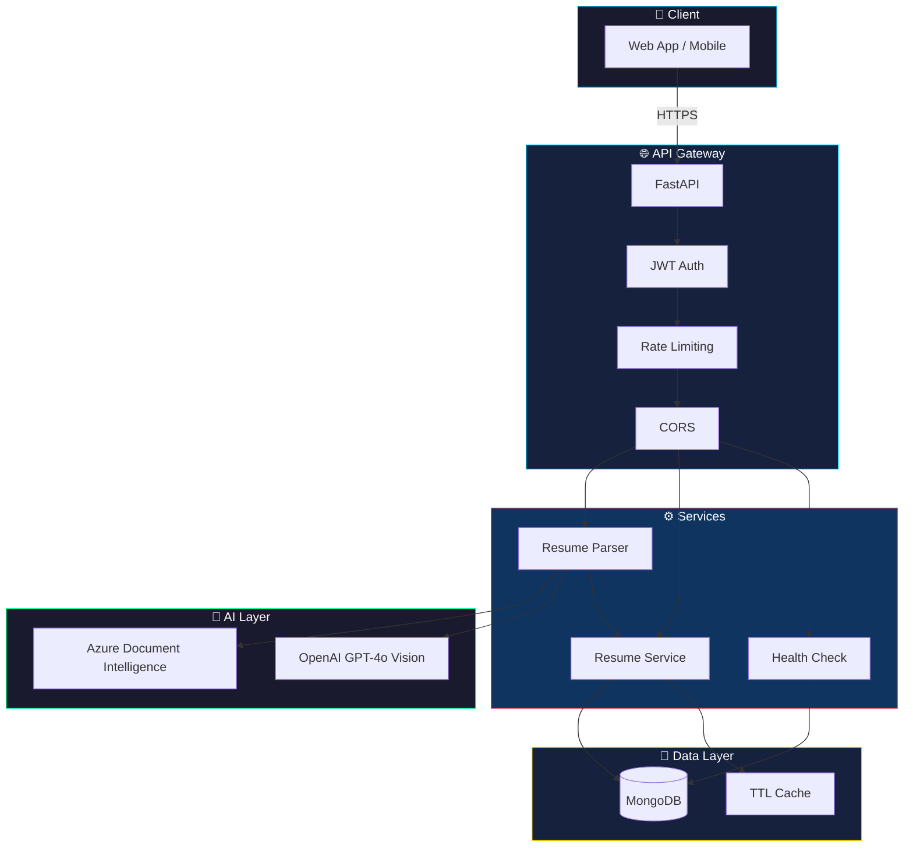
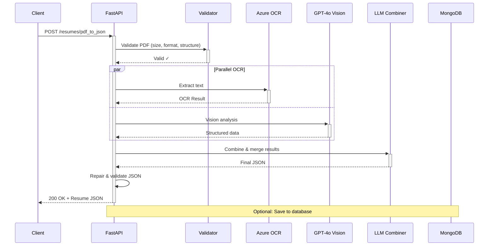
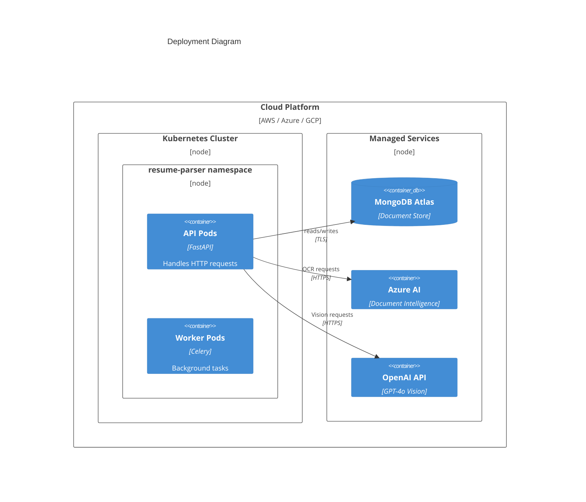
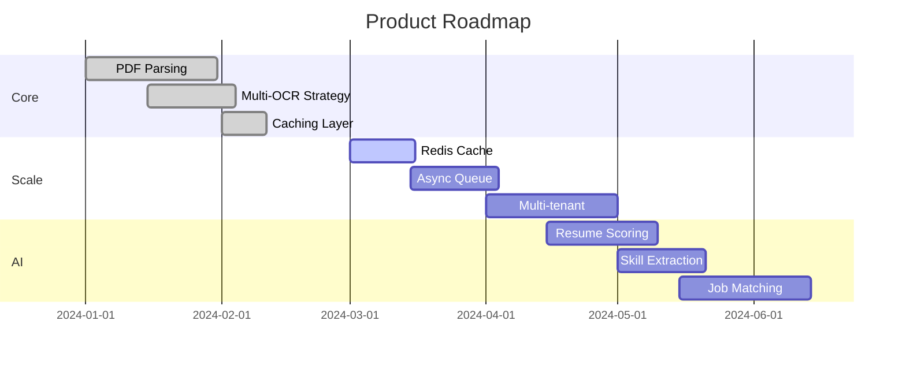

<div align="center">

# 🚀 Resume Parser Service

**Transform PDF resumes into structured data at scale.**

[](https://github.com/AIgen-Solutions-s-r-l/resume-parser-service/actions)
[](https://github.com/AIgen-Solutions-s-r-l/resume-parser-service)
[](https://python.org)
[](LICENSE)
[](https://hub.docker.com)
[](https://github.com/psf/black)

</div>

---

## 💡 Mission

> **We eliminate the friction between PDF resumes and structured data.**
> Powered by AI, built for scale.

---

## 🛠 Tech Stack

<table>
<tr>
<td align="center" width="96">

<br>FastAPI
</td>
<td align="center" width="96">

<br>Python 3.12
</td>
<td align="center" width="96">

<br>MongoDB
</td>
<td align="center" width="96">

<br>Docker
</td>
<td align="center" width="96">

<br>Azure AI
</td>
<td align="center" width="96">

<br>Kubernetes
</td>
</tr>
<tr>
<td align="center" width="96">

<br>GPT-4o
</td>
<td align="center" width="96">

<br>TTL Cache
</td>
<td align="center" width="96">

<br>GitHub Actions
</td>
<td align="center" width="96">

<br>Pydantic
</td>
<td align="center" width="96">

<br>Pytest
</td>
<td align="center" width="96">

<br>JWT Auth
</td>
</tr>
</table>

---

## ✨ Features

| Feature | Description |
|---------|-------------|
| 🔮 **Dual OCR Strategy** | Azure Document Intelligence + GPT-4o Vision for maximum accuracy |
| ⚡ **Async-First** | Non-blocking I/O with proper async patterns throughout |
| 🔐 **Secure by Default** | JWT auth, input validation, security headers |
| 📦 **Production-Ready** | Docker, K8s health probes, structured logging |
| 🚀 **High Performance** | In-memory caching, GZip compression, database indexes |
| 🧪 **Well-Tested** | Unit tests, integration tests with testcontainers |

---

## 🏗 Architecture



---

## 🔄 PDF Processing Pipeline



---

## 🚀 Deployment View



---

## 🔧 Getting Started

### Prerequisites

- Python 3.12+
- Docker & Docker Compose
- MongoDB 7.0+
- Azure & OpenAI API keys

### Quick Start

```bash
# Clone
git clone https://github.com/AIgen-Solutions-s-r-l/resume-parser-service.git
cd resume-parser-service

# Configure
cp .env.example .env
# Edit .env with your API keys

# Launch
docker-compose up -d

# Verify
curl http://localhost:8000/health
```

### Local Development

```bash
# Install dependencies
pip install poetry && poetry install

# Run with hot reload
uvicorn app.main:app --reload

# Run tests
pytest --cov=app
```

---

## 📡 API Overview

### Endpoints

| Method | Endpoint | Description |
|:------:|----------|-------------|
| `POST` | `/resumes/pdf_to_json` | Convert PDF → JSON |
| `POST` | `/resumes/create_resume` | Create resume |
| `GET` | `/resumes/get` | Get user's resume |
| `PUT` | `/resumes/update` | Update resume |
| `GET` | `/resumes/exists` | Check existence |

### Health & Metrics

| Method | Endpoint | Purpose |
|:------:|----------|---------|
| `GET` | `/health` | Service health |
| `GET` | `/ready` | K8s readiness |
| `GET` | `/live` | K8s liveness |
| `GET` | `/metrics/cache` | Cache stats |

### Example Request

```bash
curl -X POST "http://localhost:8000/resumes/pdf_to_json" \
  -H "Authorization: Bearer $TOKEN" \
  -F "pdf_file=@resume.pdf"
```

---

## ⚙️ Configuration

| Variable | Description | Required |
|----------|-------------|:--------:|
| `MONGODB` | Connection string | ✅ |
| `SECRET_KEY` | JWT secret (32+ chars) | ✅ |
| `OPENAI_API_KEY` | OpenAI API key | ✅ |
| `DOCUMENT_INTELLIGENCE_API_KEY` | Azure key | ✅ |
| `DOCUMENT_INTELLIGENCE_ENDPOINT` | Azure endpoint | ✅ |
| `LOG_LEVEL` | DEBUG/INFO/WARNING/ERROR | |
| `ENVIRONMENT` | development/production | |

---

## 🗺 Roadmap



| Priority | Feature | Status |
|:--------:|---------|:------:|
| **P1** | Redis distributed cache | 🔄 In Progress |
| **P1** | Async job queue (Celery) | 📋 Planned |
| **P2** | Multi-tenant support | 📋 Planned |
| **P2** | Resume quality scoring | 📋 Planned |
| **P3** | AI-powered skill extraction | 💡 Ideation |
| **P3** | Job-resume matching | 💡 Ideation |

---

## 🤝 Contributing

We love contributions! Here's how to get started:

```bash
# Fork & clone
git clone https://github.com/YOUR_USERNAME/resume-parser-service.git

# Create feature branch
git checkout -b feature/amazing-feature

# Make changes & test
pytest && pre-commit run --all-files

# Commit with conventional commits
git commit -m "feat: add amazing feature"

# Push & create PR
git push origin feature/amazing-feature
```

See [CONTRIBUTING.md](CONTRIBUTING.md) for detailed guidelines.

---

## 📄 License

```
MIT License

Copyright (c) 2024 AIgen Solutions s.r.l.

Permission is hereby granted, free of charge, to any person obtaining a copy
of this software and associated documentation files (the "Software"), to deal
in the Software without restriction, including without limitation the rights
to use, copy, modify, merge, publish, distribute, sublicense, and/or sell
copies of the Software.
```

---

<div align="center">

**Built with ❤️ by [AIgen Solutions](https://github.com/AIgen-Solutions-s-r-l)**

[Report Bug](https://github.com/AIgen-Solutions-s-r-l/resume-parser-service/issues) · [Request Feature](https://github.com/AIgen-Solutions-s-r-l/resume-parser-service/issues) · [Documentation](https://github.com/AIgen-Solutions-s-r-l/resume-parser-service/wiki)

</div>
